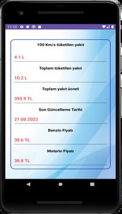

<h1> Fuel Calculation Application <h1>
<h2> Component Tree  </h2>

<ul>
    <li> Constraint Layout </li>
    <li> Linear Layout  </li>
    <li> Radio Group </li>
    <li> Ad View </li>

</ul>

<h2> Used Technologies </h2>

<ul>
    <li> Retrofit Library </li>
    <li> Intent Library  </li>
    <li> Locale Library </li>
    <li> API (OPET) </li>
    <li> Splash Screen </li>

</ul>
 
 
 

 

 

<a href="https://play.google.com/store/apps/details?id=app.Api.fuelcalculationapp&hl=tr&gl=US">
  
